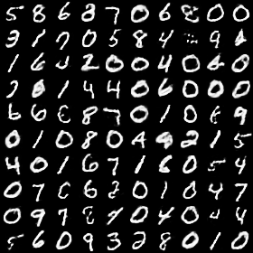

--- WORK IN PROGRESS ---

## Description

Example scripts for a type of artificial neural network called a Restricted Boltzmann Machine (RBM) are written from scratch, revealing how to implement the underlying algorithms without the need for an external library. The model is trained using Persistent Contrastive Divergence (PCD), an algorithm that loosely resembles Hebbian learning. All code is written in Julia, a programming language with a syntax similar to Matlab.

The neural network is trained as a generative model on the MNIST dataset of handwritten digits. Many of the samples collected from the model look as if they were made by a person. Because the label for each handwritten digit is included during the training process, the neural network can also be used to classify handwritten digits. Predictions are made by computing the expected value of the label given the features, which removes the need to fine-tune the neural network as a discriminative model. With this approach, an accuracy of 98.18 % is achieved on the test dataset.

## Download

* Download: [zip](https://github.com/jostmey/RestrictedBoltzmannMachine/zipball/master)
* Git: `git clone https://github.com/jostmey/RestrictedBoltzmannMachine`

## Requirements

The code requires the Julia runtime environment. Instructions on how to download and install Julia are [here](http://julialang.org/). The scripts have been developed using version 0.4 and may not work on previous versions of Julia.

Several modules are required. To install them, launch `julia` and run the following commands.

`Pkg.add("MNIST")`  
`Pkg.add("StatsBase")`  
`Pkg.add("Images")`

The first package contains both the training and test data of the MNIST set of handwritten digits. The second package contains a function used to randomly pick among among a set of weighted choices. The last package is used to render images created by the model. If the rendering fails trying running`using Images` in `julia` to see if any other software will need to be installed.

## Run

The first step in building the model is to pre-fit the bias terms of each neuron to the mean of the data. Then the training procedure can be started. The process may take several days to complete. To get started, run the following commands.

`julia fit.jl > fit.out`  
`julia train.jl > train.out`

The scripts automatically create a folder called `bin` where the parameters of the trained neural network are saved once the model is built. To generate samples from the neural network, run the following command.

`julia generate.jl > generate.out`

A sequence of samples will be saved to`generate.png`. To classify the handwritten digits in the test set, run the below command.

`julia classify.jl > classify.out`

The accuracy of the model will be written at the end of `classify.out`.

## Performance

This package is not written for speed. It is meant to serve as a working example of an artificial neural network. As such, there is no GPU acceleration. Training can take days using only the CPU. The training time can be shortened by reducing the number of updates, but this could lead to poorer performance on the test data. Consider using an existing machine learning package when searching for a deploy ready solution.

## Theory

###### Model

A Restricted Boltzmann machine (RBM) is a generative model that learns to represent a dataset as a joint probability distribution over its features. What this means is that statistical samples drawn from the model will look like the types of things found in the dataset. The neural network essentially learns how to "make up" its own versions of the data.

The neurons in an RBM are divided into two layers: A visible layer that represents the sensory input and a hidden layer that is determined solely by its connections to the visible layer. The values of the neurons in the visible layer are represented by the vector `v` and the values of the hidden layer are represented by the vector `h`. An RBM can be thought of as a probability distribution described by an energy function `E(v,h)`. The energy function returns a scalar value given the state of every neuron in the model. As is the case with any energy based system, the probability of observing a specific state is proportional to `exp(-E(v,h))` (assuming the temperature factor is one). The negative sign means that if the energy is high the probability will be low. Using the energy to calculate an exact probability requires a normalization constant, which is typically denoted by `Z`. The normalization constant is the sum of `exp(-E(v,h))` over all possible states of `v` and `h`, so in general determining the exact value for `Z` is an intractable problem.

In a typical RBM, the energy function takes the form `E(v,h) = -v'*W*h - b'*v - a'*h`. The matrix `W` describes the weights of the connections between neurons in the visible and hidden layers, and the vectors `b` and `a` describe the bias terms. The operator `'` transposes the vector in front of it. Notice that after transposing each vector we end up with a scalar value when we carry out each multiplication.

###### Sampling

Gibbs sampling is used to update the state of each neuron. Imagine flipping the ith neuron so that is `on` while leaving the rest of the neural network unchanged. We will write the energy associated with this state as `E``i=1``(v,h)`. The probability that the ith neuron is `on` is therefore proportional to `exp(-E``i=1``(v,h))`. To get ride of the normalization constant `Z` we will divide this by the total probability that the ith neuron is either `on` or `off` which is proportional to `exp(-E``i=0``(v,h)) + exp(-E``i=1``(v,h))`. The division will not change the result because the total probability that the ith neuron is either `on` or `off` must add up to one, but the normalization constant `Z` will cancel out. With the normalization constant removed, the quotient can be written in terms of the logistic function by dividing the top and bottom by the numerator, in which case the result is `Sigmoid(-E``i=0``(v,h) - E``i=1``(v,h))`. Once we have calculated the probability of the ith neuron being `on`, we can randomly assign it a new state of either `0` or `1` based on its probability. The entire neural network can be updated by looping over each neuron and updating it. After passing over and updating every neuron in the neural network several time, the model can reach what is called equilibrium.

A RBM is said to be restricted because connections between neurons in the same layer are removed (unlike a general Boltzmann machine). The only connections that exist are between the visible and hidden layers. Without cross connections, neurons in the same layer depend only on the state of the neurons in the other layer. Therefore, neurons in the same layer can be updated simultaneously in a single sweep. All the neurons in the hidden layer can be updated simulatneously given the visible layer, and then all the neurons in the visible layer can be updated given the new state of the hidden layer. The process must be repeated many times to reach equilibrium.

###### Training

The learning rule for a RBM is derived by taking the derivative of the log-likelihood of the data. Using the derivative, the strength of the weights connecting neurons are adjusted a little bit at a time to nudge the model up the gradient of the log-likelihood function. In the language of statistics, a RBM is trained by obtained a Maximum Likelihood Estimation (MLE) of the model's parameters.

The derivative of the likelihood function for a RBM is remarkably simple: It is the difference between two expectations. The first expectation is `<-dE(v,h)/du)>``DATA`, where `u` is any parameter of the model. The expectation is calculated over the data---so to sample `v` and `h` we simply need to load an item in the dataset and update the hidden layer. The result is subtracted by the second expectation `<-dE(v,h)/du>``MODEL`, which is calculated over the model. Sampling from the model requires starting from a random initial state of `v` and `h` and updating the hidden and visible layers several times until equilibrium is reached. Because none of the neurons are constrained, many steps are required to reach equilibrium. For this reason, a set of persistent states are maintained where new samples of the model are obtained from previous samples of the expectation. The idea is that because the parameters are gradually updated following the gradient of the log-likelihood, the equilibrium states will gradually change as well. Therefore, after each parameter update the persistent states are updated only a few times to re-reach equilibrium.

One problem with gradient optimization methods is that the fitting procedure may not find the global maxima of the log-likelihood. A momentum term is included to help escape from local minimums.

###### Prior

The neural network contains nearly `400 000` parameters. To prevent overfitting, a prior is added to the parameters to reduce the hypothesis space. In this example we use a Gaussian centered as zero. To account for the prior, we have to add the log-derivative of the prior to each weight update. This bias term that is added to the fitting procedure means that instead of obtaining a MLE for the model's parameters we are obtaining a Maximum A Posteriori (MAP) estimation.

Normally the training data should be split into a training and validation set. Multiple versions of the model are then tried on the training set, each using different values for the learning rate, momentum factor, prior probability distribution, and number of updates. The model that scores the highest on the validation set is then used on the test data. The use of a validation set means that the test data is never seen while selecting the best model, which would otherwise amount to cheating. That said, no validation set is used in this example because the model is never refined--only one version of the model is trained. This model is then tested directly on the test data.

###### Model

In this example, the features and labels of the MNIST dataset of handwritten digits were loaded into the visible layer. This way, the neural network can be used as a generative model to create samples that resemble what it is trained on while at the same time allowing it to be used as a classifier. To represent the features of the MNIST dataset, the intensity of each pixel is used as the mean value of a Bernoulli distirubion. Samples collected from the Bernoulli distribution, which are binary, can then be loaded into the visible layer. To represent the layer, a softmax unit is used, which is a multinomial generalization of a neuron. The use of a softmax unit does not change the gradient optimization procedure used to fit the parameters.

To run as a generative model, each of the neurons must be updated until the neural network reaches equilibrium. At this point, the neurons in the visible layer that corresponded to the features are read and their values used to generate an image. The resulting images resemble the types of things found in the training data.

To run as a classifier, we must compute the expected value of the label given the features. To generate samples for this expectation, the features and a random label are loaded into the visible layer. The neurons in the hidden layer along with the neuron represneting the label are repeatedly updated until equilibrium is reached. The value of the label after reaching equilibrium is then used to help calculate the expectation.

###### References

[comment]: # (BIBLIOGRAPHY STYLE: MLA)

1. Ackley, David H., Geoffrey E. Hinton, and Terrence J. Sejnowski. "A learning algorithm for boltzmann machines*." Cognitive science 9.1 (1985): 147-169.
2. Smolensky, Paul. "Chapter 6: Information Processing in Dynamical Systems: Foundations of Harmony Theory. Processing of the Parallel Distributed: Explorations in the Microstructure of Cognition, Volume 1: Foundations." (1986).
3. Robbins, Herbert, and Sutton Monro. "A stochastic approximation method." The annals of mathematical statistics (1951): 400-407.
4. Tieleman, Tijmen. "Training restricted Boltzmann machines using approximations to the likelihood gradient." Proceedings of the 25th international conference on Machine learning. ACM, 2008.
